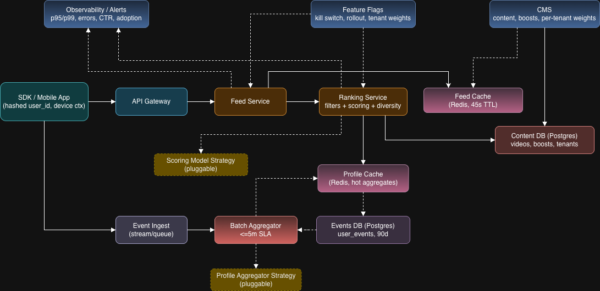

# Storyteller Personalized Feed – System Design (Tech Lead Task)

## 1) Scope & Goals
- Deliver a personalized vertical video feed for mobile SDKs using the existing backend/CMS, rolled out behind a feature flag with safe fallback.
- Meet non-negotiable constraints:
  - Scale: peak 3k RPS (avg ~600).
  - Latency: p95 < 250 ms; p99 < 600 ms for 20 items.
  - Freshness: content visible ≤ 60 s; user-signal lag ≤ 5 min.
  - Privacy: hashed user_id only; no PII outside VNet; event retention 90 days.
  - Multi-tenant: 120 tenants; per-tenant weights/flags.
- Prototype deliverables: architecture, data/API contracts, rollout/observability, trade-offs, and a working endpoint with caching.
- Keep design pragmatic/minimal now; note clear next steps for future improvements.

## 2) Architecture Overview

- Flow: SDK → API Gateway → Feed Service → Ranking Service → Content DB; signals via Event Ingest → Batch Aggregator → Profile Cache; feed responses cached; flags/observability as control plane; CMS publishes content and invalidates feed cache.

## 3) Components (current prototype)
- SDK / Mobile App: calls `GET /v1/feed`, passes `tenantId`, `userIdHash`, `limit`; sends events to `/v1/events`.
- API Gateway: routing/auth; (flags handled in services, not at gateway).
- Feed Service: orchestrates; checks feature flag; uses feed cache (Redis, 45s TTL); calls Ranking or fallback; sets cache headers/ETag (non-personalized).
- Ranking Service: loads tenant weights, videos, boosts; reads user profile (Redis); scores by recency/popularity/affinity + editorial boost; fallback sorted by popularity.
- Profile Cache (Redis): `profile:{user_hash}` hot aggregates from events; written by AggregationService; read by Ranking.
- Feed Cache (Redis): `feed:{tenant}:{user}:{limit}:personalized` or `feed:{tenant}:fallback:{limit}`; written/read by Feed Service; TTL 45s.
- Content DB (Postgres): `videos`, `tenants`, `editorial_boosts`.
- Events DB (Postgres): `user_events` sharded by month/year for fast writes/reads; retention 90d.
- Batch Aggregator: scheduled (3m) aggregation from recent events → profiles in Redis.
- CMS: manages videos/boosts/tenant weights; webhook to invalidate feed cache.
- Feature Flags: per-tenant personalization toggle + global kill-switch (InternalController).
- Observability: today only logs; metrics (p95/p99, errors, cache hit, adoption/CTR) and dashboards are planned.

## 4) Latency Budget (target p95 < 250 ms, p99 < 600 ms for 20 items)
- Edge/network: DNS + TLS + API Gateway routing/auth ~20–50 ms p95 (assumes warmed connections/CDN or LB close to clients).
- Personalized, cache HIT: Redis fetch/deserialize 5–10 ms, app overhead 10–20 ms → ~20–30 ms (app tier), end-to-end with edge ~40–80 ms.
- Personalized, cache MISS (app tier):
  - Tenant/profile lookup (Redis + repo) ~10–20 ms.
  - Videos + boosts read (Postgres, indexed) ~50–90 ms.
  - Scoring 20 items (in-memory) ~10–25 ms.
  - Response build + serialization ~10–20 ms.
  - App subtotal: ~80–155 ms; adding edge/network → ~100–205 ms p95.
- Fallback, cache MISS: videos read + popularity sort ~60–100 ms; response ~10–20 ms → ~70–120 ms app; with edge ~90–170 ms.
- Safety margin to p99 600 ms covers DB jitter, cold connections, GC, and regional variance; additional protection via feed cache TTL (45s) and fallback path.

## 5) Data Model (minimal)
- Postgres
  - `videos(video_id PK, title, url, thumbnail_url, tags[], popularity_score, created_at)`
  - `tenants(tenant_id PK, name, weights JSON/columns, personalized_enabled bool)`
  - `editorial_boosts(boost_id PK, video_id FK, boost_factor, starts_at, ends_at)`
  - `user_events(event_id PK, user_id_hash, tenant_id?, video_id FK, event_type, metadata JSON, created_at)` — retention 90d.
- Redis
  - Profile cache: `profile:{user_hash}` → `UserProfile(tagScores map, version)`, TTL via rewrite; hot aggregates.
  - Feed cache: `feed:{tenant}:{user}:{limit}:personalized` and `feed:{tenant}:fallback:{limit}` → `FeedResponse`, TTL 45s.

## 6) API Contract (prototype)
- `GET /v1/feed?tenantId={uuid}&userIdHash={hash}&limit={int=20}`
  - 200 OK: `{"items":[{videoId,title,url,thumbnailUrl}], "feedId": "<uuid>"}` (feedId = response version)
  - Caching:
    - Personalized: `Cache-Control: private, max-age=30`.
    - Non-personalized: ETag = `fallback-{tenant}-v1`; `Cache-Control: public, max-age=300`; 304 if If-None-Match matches.
  - Errors: 400 invalid params; 404 tenant not found; 500 internal.
- `POST /v1/events`
  - Body: `tenantId, userIdHash, videoId, eventType (VIEW|LIKE|SHARE), metadata(optional)`.
  - 202 Accepted on success; 404 if video missing; 400 validation errors.
- Internal (ops/CMS):
  - `POST /internal/cms-webhook {tenantId}` → invalidates feed cache for tenant.
  - `POST /internal/kill-switch?enabled=bool` → toggle all personalization.
  - `POST /internal/tenant-flag?tenantId&enabled=bool` → per-tenant flag.
  - `POST /internal/trigger-aggregation` → manual profile recompute.

## 7) CMS Configuration & Delivery Rules
- Editorial boosts per video (time-bounded).
- Tenant-specific ranking weights (recency/popularity/affinity).
- Personalization flag per tenant (enable/disable).
- Webhook to invalidate feed cache on content/config changes.

## 8) Caching Strategy
- Feed cache (Redis, 45s): keyed by tenant/user/limit or fallback; owned by Feed Service.
- Profile cache (Redis): hot aggregates from events; refresh every ≤3m aggregation; decays old scores.
- HTTP caching: ETag + public max-age for non-personalized; short private max-age for personalized.

## 9) Rollout, Fallback, Safety
- Feature flags: per-tenant + global kill switch. Fail-safe default = non-personalized if tenant missing.
- Fallback feed: popularity-based, ETag-enabled.
- Cache miss/degradation: serve fallback if profile missing or ranking errors.

## 10) Trade-offs & Decisions
- Ranking evolution (keep simple first):
  - **Now:** simple heuristics (recency/popularity/affinity + boosts) for speed and transparency.
  - **Mid-step:** add lightweight local classifiers (Python) or public models to enrich content/user signals for richer ranking without heavy infra.
  - **Later:** heavier ML/recommender stack if/when needed.
- Domain isolation: ranking scoring and profile aggregation are extracted into pluggable domain strategies (baseline impl now), so A/B or tenant-specific formulas can be swapped without touching service orchestration.
- Redis for both profiles and feed responses — meets latency; keeps Postgres simpler.  
  **Future:** add compression and/or an extra caching tier to save network traffic and memory at scale.
- Event ingest — **Now:** direct-to-DB, cheapest/simple.  
  **Mid-step:** tighter cron/micro-batching without a bus to improve freshness.  
  **Future:** move to a message bus (e.g., Kafka) for durability, back-pressure, and fan-out to aggregation/analytics at higher scale.
- Aggregation — **Now:** fixed 3m batch meets ≤5m lag with low complexity.  
  **Future:** adaptive cadence (driven by monitoring/load), or streaming/incremental updates if freshness needs tighten.
- Tenant flags — **Now:** handled at service layer (simple integration).  
  **Future:** move to gateway-level flagging to cut downstream load; all needed data is available at the edge.
- Event storage sharding — **Now:** month/year sharded `user_events` to speed writes/reads.  
  **Future:** adjust shard count based on load and consider sharding by other fields to keep distribution even.
- Observability — Now: logs only. Planned: metrics/alerts (p95/p99, errors, cache hit, aggregation lag, personalization adoption/CTR proxy).

## 11) Next Steps / With More Time

- Online profile updates: move from coarse batch to more frequent cron/micro-batch; keep it lightweight (avoid heavy Kafka for cost now) while improving freshness.
- CMS-driven aggregation selection: allow choosing different profile aggregation/decay policies per tenant (similar to scoring models) for experiments and gradual rollouts.
- Ranking quality: add diversity/dup controls and expand business/policy/maturity filters.
- Logging: ship convenient structured logging for faster debugging and tracing.
- Observability: add dashboards and SLOs with burn-rate alerts (latency, errors, cache hit rate, aggregation lag).
- Data-driven optimization: use the dashboards/SLO signals to decide when to change architecture (e.g., more shards, bus adoption, caching tiers).
- CMS-driven scoring selection: allow choosing/scoping different scoring models per tenant from CMS (feature-flag/A-B) to safely roll out and compare formulas.

Additional options (deployment & perf):
- Deploy to cloud (e.g., AWS) to validate in real environments.
- Harden edge/security (e.g., AWS Shield/WAF) and tighten service security.
- Configure CDN properly for assets and cacheable responses.
- Set up autoscaling policies for API and supporting services.
- Provide a repeatable performance/load test script (wrk/k6/JMeter) with env defaults.

